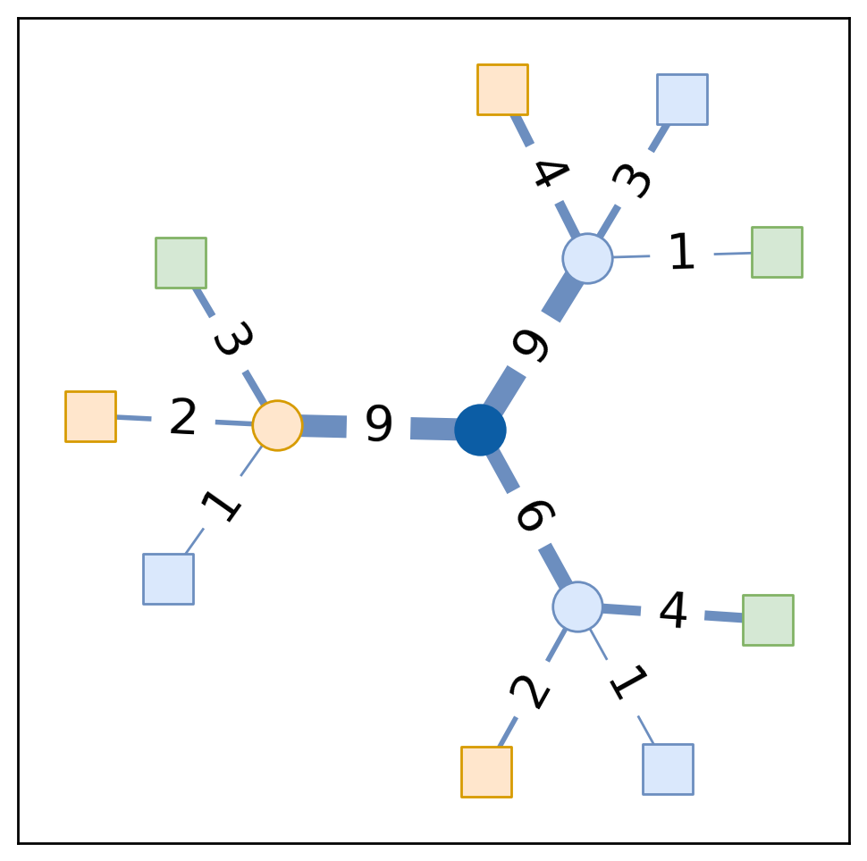
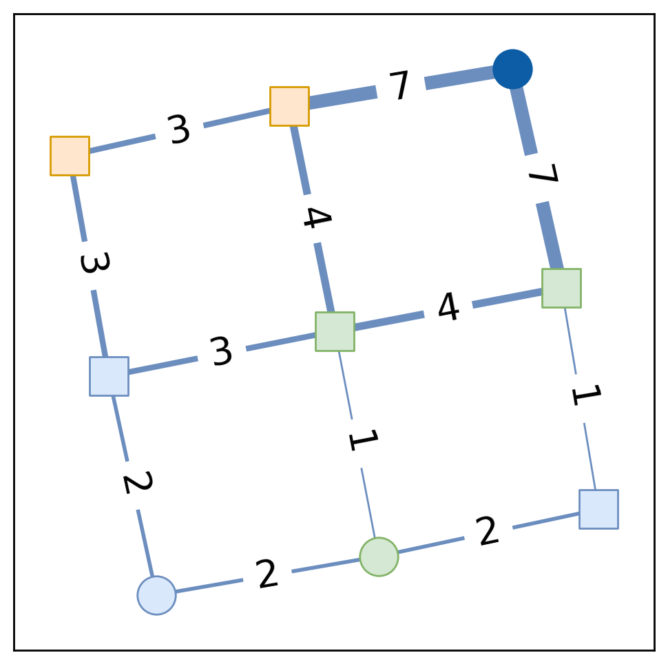
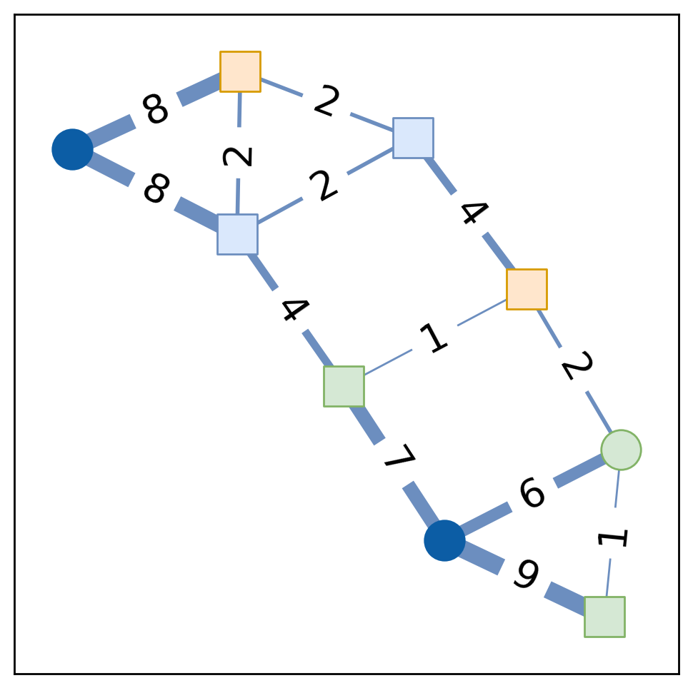
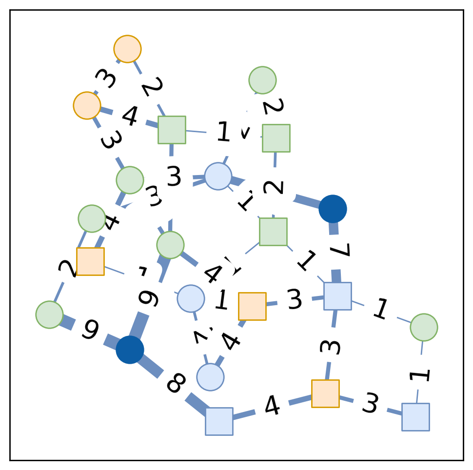

## Code of Enabling Long-term Fairness in Dynamic Resource Allocation

Simulator of experiments presented in
> T. Si Salem, G. Iosifidis, and G. Neglia, "Enabling Long-term Fairness in Dynamic Resource Allocation", ACM SIGMETRICS 2023.

Please cite this paper ([a preprint is available](https://arxiv.org/pdf/2208.05898.pdf)) if you intend to use this code for your research.

**Reproduce Results.**

* Install Anaconda (v22.10.0) for [Linux-x86_64](https://repo.anaconda.com/archive/Anaconda3-2022.10-Linux-x86_64.sh)
* Create conda environment: `conda env create -f environment.yml`
* Add execute permission to scripts: `chmod +x scripts/*`
* Execute experiments (logs will be saved in `res/` directory and PDF figures will be saved in `out_figs/` directory): `sh scripts/reproduce.sh`

**Simulator Usage.** The simulator is executed through the main pyton file `main.py`:

      --max_capacity MAX_CAPACITY
                            Maximum capacity per cache
      --min_capacity MIN_CAPACITY
                            Minimum capacity per cache
      --max_weight MAX_WEIGHT
                            Maximum edge weight
      --min_weight MIN_WEIGHT
                            Minimum edge weight
      --time_horizon TIME_HORIZON
                            Time horizon
      --catalog_size CATALOG_SIZE
                            Catalog size
      --query_nodes QUERY_NODES
                            Nodes generating queries
      --graph_size GRAPH_SIZE
                            Network size
      --graph_degree GRAPH_DEGREE
                            Degree. Used by balanced_tree, regular, barabasi_albert, watts_strogatz
      --graph_p GRAPH_P     Probability, used in erdos_renyi, watts_strogatz
      --random_seed RANDOM_SEED
                            Random seed
      --players PLAYERS     Number of agents
      --debug_level {INFO,DEBUG,WARNING,ERROR}
                            Debug Level
      --cache_type {fair,fairslotted,lru,lfu}
                            Policy type: fair is online horizon fair (OHF) policy, fairslotted is online slot fair (OSF)
                            policy
      --traces TRACES       Traces' paths (generated by tracegenerator.py)
      --construct_pareto_front
                            Construct the Pareto front
      --n_pareto_front N_PARETO_FRONT
                            Number of samples to construct Pareto front
      --construct_utility_point_cloud
                            construct feasibility set (point cloud)
      --n_utility_point_cloud N_UTILITY_POINT_CLOUD
                            Number of random samples to construct feasibility set
      --cached_offline_results
                            Reuse offline results (Pareto front, feasibility set, static OPT, etc.)
      --output OUTPUT       Output path
      --alpha ALPHA         Inequality aversion parameter (alpha-fairness parameter)
      --custom_weights CUSTOM_WEIGHTS
                            Customize the retrieval costs (weights)
      --scale_repo_weight SCALE_REPO_WEIGHT
                            The retrieval cost to any repository node is scaled by this factor
      --fairslotted_freeze_period FAIRSLOTTED_FREEZE_PERIOD
                            Freezing period for fairslotted policy
      --telescope_requests  Traces are loaded at each query node. When this parameter is enabled, only a single request
                            batch is generated at a randomly selected node.
      --external_disagreement_points EXTERNAL_DISAGREEMENT_POINTS
                            Input disagreement points (Nash bargaining scenario) alpha = 1
      --umin_umax UMIN_UMAX
                            Input minimum and maximum value of benchmark utility
      --resources_bias RESOURCES_BIAS
                            Zipf distribution exponent. The number of nodes associated to each agent are generated
                            according to this distribtution. When set to 0, the number of nodes associated to each agent
                            is uniform on average.
      --repo_nodes REPO_NODES
                            Number of Repository nodes permanently storing the catalog.
      --graph_type {erdos_renyi,balanced_tree,hypercube,cicular_ladder,cycle,grid_2d,lollipop,expander,star,barabasi_albert,watts_strogatz,regular,powerlaw_tree,small_world,geant,abilene,dtelekom,servicenetwork,line}
                            Graph type
      --experiment_name EXPERIMENT_NAME
                            Experiment Name (allows for offline results reuse by sub-experiements)
      --experiment_subname EXPERIMENT_SUBNAME
                            Sub-experiment Name
      --record_offline_stats_only
                            Record offline statistics only (Pareto front, feasibility set, static OPT, etc.)

The traces used by the simulator can be generated by executing `tracegenerator.py`:
      
    --time_horizon TIME_HORIZON
                            Time horizon
      --catalog_size CATALOG_SIZE
                            Catalog size
      --distribution_roll DISTRIBUTION_ROLL
                            Distribution roll
      --batch_min_size BATCH_MIN_SIZE
                            Batch min size
      --batch_max_size BATCH_MAX_SIZE
                            Batch max size
      --zipfs_exponent ZIPFS_EXPONENT
                            Zipfs law exponent
      --random_seed RANDOM_SEED
                            Random seed
      --traces_dir TRACES_DIR
                            Trace output
      --adversarial_1       Adversarial trace type
      --adversarial_2       Adversarial trace type
      --shuffle             Shuffle the request process. Convert any trace to a stationary one, but maintaining the same
                            static optimum

**Examples.**
Execution examples can be found in `scripts/` directory. We provide here, as an example, the configurations of the different topologies:

|                                                                              Tree                                                                               | Grid                                                      | Abilene                                                   | GEANT                                                   |
|:---------------------------------------------------------------------------------------------------------------------------------------------------------------:|-----------------------------------------------------------|-----------------------------------------------------------|---------------------------------------------------------|
|                                                                                                           |  |  |  |
|                `--graph_type balanced_tree --graph_size 8 --query_nodes 4 --min_capacity 1 --max_capacity 5 --players 3`                            |                `--graph_type grid_2d --graph_size 8 --query_nodes 2 --repo_nodes 1 --min_capacity 1 --max_capacity 5 --players 3`                                      |                `--graph_type abilene --query_nodes 2 --repo_nodes 2 --min_capacity 1 --max_capacity 5 --players 3`                                                |                `--graph_type geant --query_nodes 3 --repo_nodes 2 --min_capacity 1 --max_capacity 5 --players 3`                                         |

We provide another example. To reproduce a specific figure (Fig. 11 (b) in paper), execute the following:
``` bash
    # Simulate instance
    conda activate acm_sigmetrics #Activate environment acm_sigmetrics
    B=50 # Batch size
    T=5000 # Time horizon
    for exponent in 1.2; do 
      # Generate traces
      python tracegenerator.py --batch_min_size $B --batch_max_size $B --time_horizon ${T} --zipfs_exponent 1.2 --adversarial_1 --shuffle
      python tracegenerator.py --batch_min_size $B --batch_max_size $B --time_horizon ${T} --zipfs_exponent 1.2 --adversarial_2
      # Run processes in parallel for alpha = 3, and for policies fair (OHF) and fairslotted (OSF).
      for param in 3.0; do
        python main.py --alpha ${param} --custom_weights 1-2-2 --traces traces/trace_catalog_20_T_${T}_B_${B}_${B}_s_1.2_roll_0_adv_1.pk-traces/trace_catalog_20_T_${T}_B_${B}_${B}_s_${exponent}_roll_0_adv_2.pk --cache_type fairslotted --output res/2players-online-adversarial-$B --construct_utility_point_cloud --construct_pareto_front --cached_offline_results --external_disagreement_points 0.0-0.0 --experiment_subname fairslotted_${param} --time_horizon $T &
        python main.py --umin_umax 0.1-1.0 --alpha ${param} --custom_weights 1-2-2 --traces traces/trace_catalog_20_T_${T}_B_${B}_${B}_s_1.2_roll_0_adv_1.pk-traces/trace_catalog_20_T_${T}_B_${B}_${B}_s_${exponent}_roll_0_adv_2.pk --cache_type fair --output res/2players-online-adversarial-$B --construct_utility_point_cloud --construct_pareto_front --cached_offline_results --external_disagreement_points 0.0-0.0 --experiment_subname fair_${param} --time_horizon $T &
      done
    done
    # ...when simulation terminates
    # Plot results
    python plotter.py --ylim 0.45-0.6 --xlim 0.45-0.85 --task 2dplot --output ./out_figs/2players-online-adversarial-50.pdf --input ./res/2players-online-adversarial-50/ --policies fair-fairslotted --legend --alpha 2.0    
```
The above script correponds to executing `scripts/twoplayers-pareto-online-adversarial.sh` and `scripts/plot-experiments.sh`.

---

**Keywords:** Online learning, Multi-timescale fairness, Axiomatic bargaining, Dynamic
resource allocation, Regret analysis, Adversarial analysis, Cache network simulator, Gradient descent, Online optimization.
